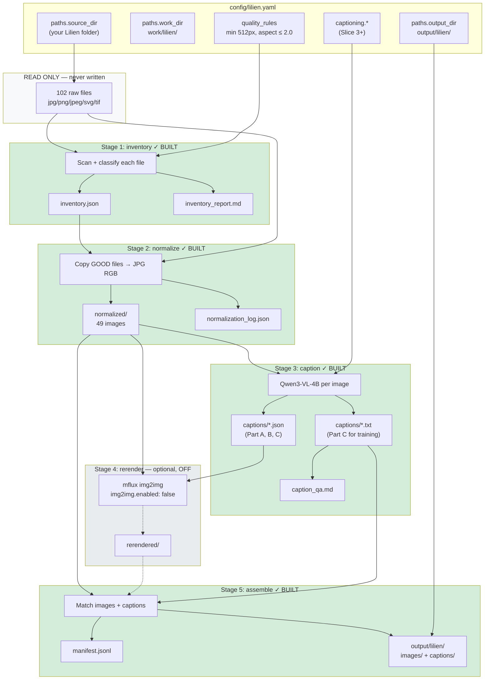
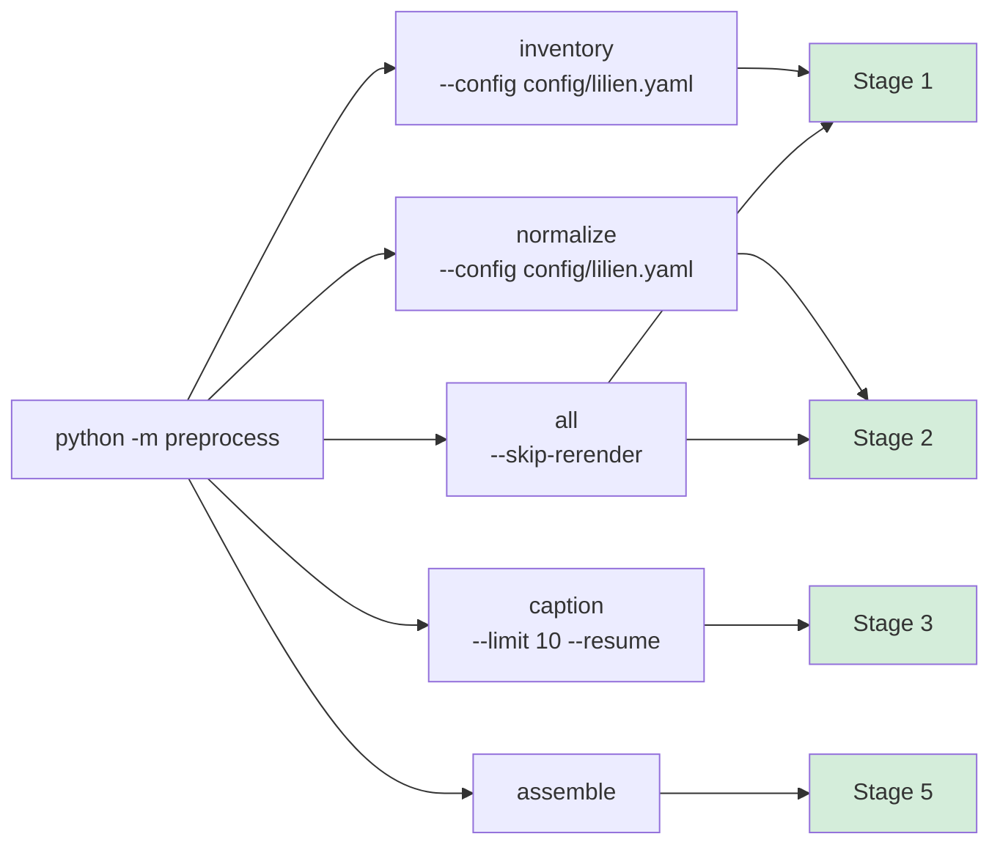
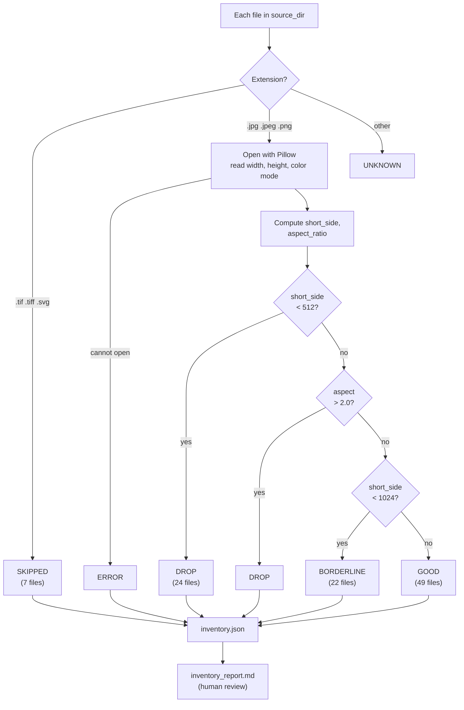
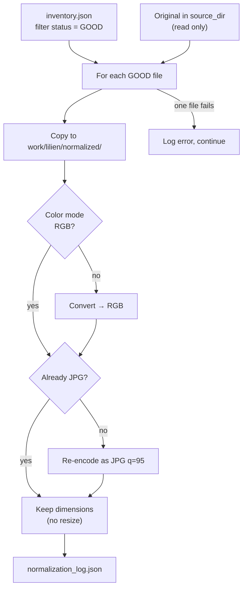
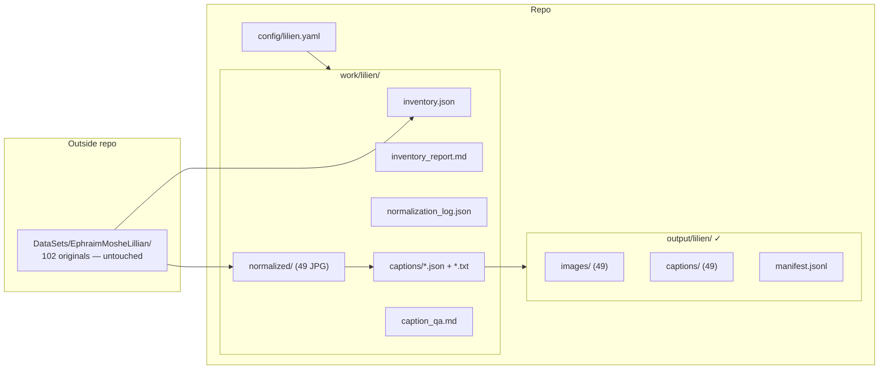
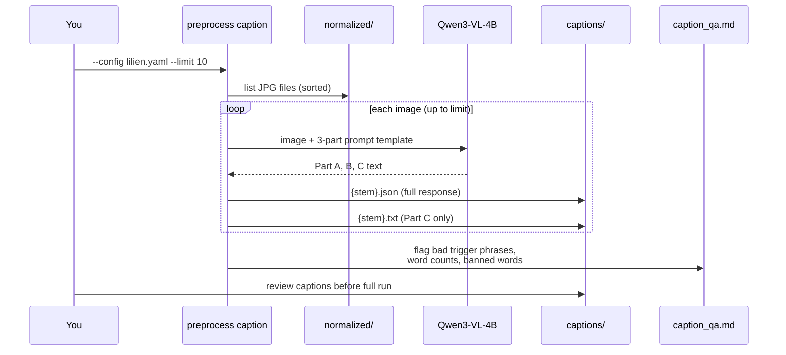

# Preprocess pipeline diagram

How `preprocess` works for the Lilien LoRA project. **Green** = built · **Yellow** = planned · **Gray** = optional/off.

See also: [lora-preprocessing PRD](../stories/lora-preprocessing/PRD.md), [lora_preprocessing_spec.md](../../lora_preprocessing_spec.md).

---

## Big picture

Everything is driven by one config file. Stages run in order; each reads the previous stage's output and writes new artifacts under `work_dir`. **Source images are never modified.**

---

## CLI entry points

---

## Stage 1: Inventory

Read-only scan. No copies, no edits.

---

## Stage 2: Normalize

Only `GOOD` files from inventory (unless `--include-borderline`).

---

## Directories (Lilien project)

---

## Stage 3: Caption (sequence)

Part **C** → training caption (trigger phrase + description). Part **B** → img2img rerender only (disabled for Lilien).

---

## Revision log

| Date | Change |
|------|--------|
| 2026-05-25 | Slice 4 assemble built; Lilien v3 49 pairs → `output/lilien/` |
| 2026-05-25 | Slice 3 caption stage built; VLM resize cache noted |
